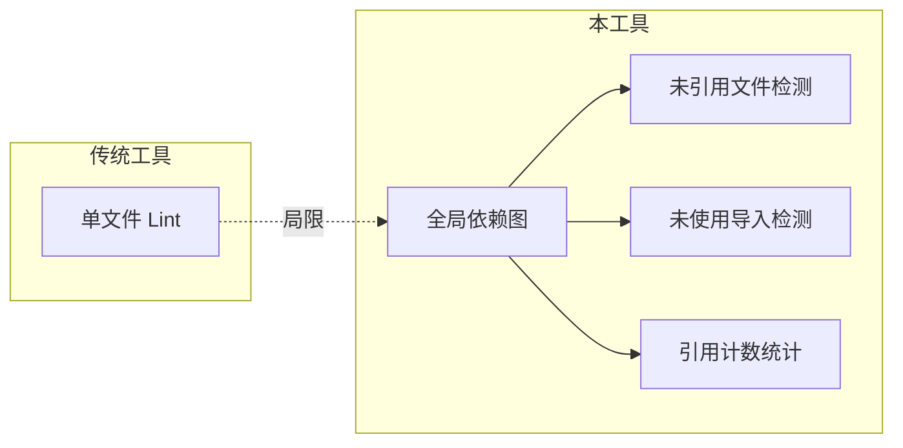
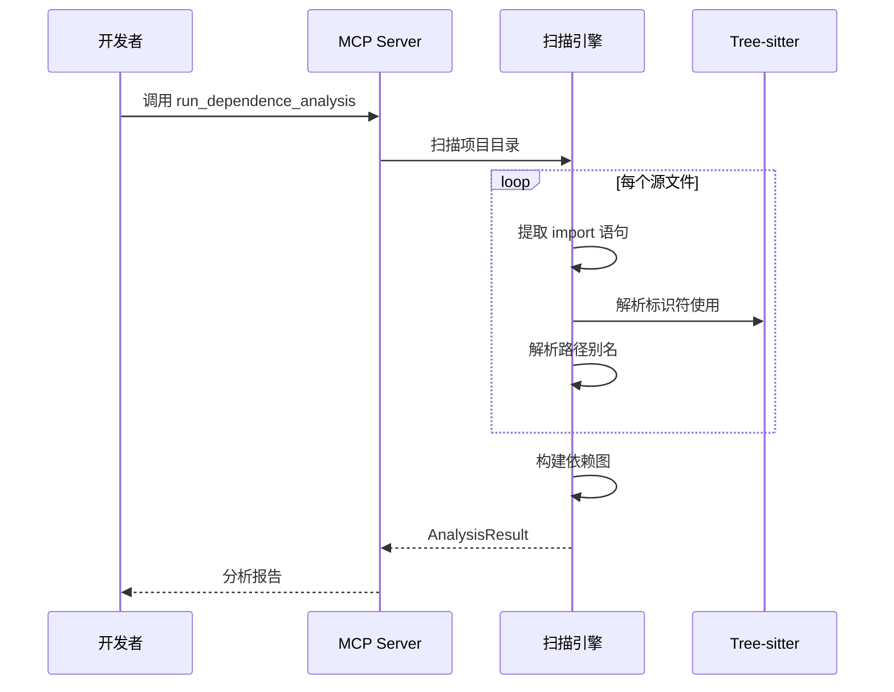

# dependence-analysis-mcp

一个 MCP Server(支持 stdio/HTTP 双模式)用于扫描前端/Node 项目的 ESModule 依赖关系,帮助你快速找出:

- ✅ **已引用文件** — 被 import 且确实有使用，附带引用次数
- 🧹 **未引用文件** — 存在于项目中但从未被其他文件引用
- 💤 **未使用导入** — 存在 `import`，但导入的标识符从未使用

---

## 🎯 为什么需要这个工具？

### 问题背景

大型前端项目迭代中常见的"死代码"问题：

| 传统方法                | 局限性                                   |
| ----------------------- | ---------------------------------------- |
| ESLint `no-unused-vars` | 只检测单文件内，无法发现跨文件的废弃代码 |
| IDE "查找引用"          | 需逐个手动检查，无法批量分析             |
| TypeScript 编译器       | 不报告未被引用的导出                     |

### 解决方案

通过 **全局依赖图分析**，一次性识别出所有未引用文件和未使用导入：



### 核心分析流程



### 适用场景

| 场景        | 效果                 |
| ----------- | -------------------- |
| 🧹 项目清理 | 定位可删除的废弃代码 |
| 📦 打包优化 | 减少 bundle 体积     |
| 📚 代码审计 | 评估项目健康度       |
| 🔄 重构准备 | 了解模块依赖关系     |

---

## ✨ 特性

- 🎯 支持 React / Vue / Angular / Node（`.js/.jsx/.ts/.tsx/.vue`）
- 🧠 Tree-sitter AST 级未使用导入检测，大幅降低误判
- 🔗 路径别名支持：`tsconfig.json` paths + `vite.config.*` alias
- 🚫 智能忽略 `node_modules/dist/tests/...` 等目录

---

## 📦 安装 & 快速开始

```bash
# 克隆仓库
git clone https://github.com/bugfix2020/dependence-analysis-mcp.git
cd dependence-analysis-mcp

# 安装依赖
pip install -e .

# stdio 模式(默认,用于 MCP 客户端如 Claude Desktop)
dependence-analysis-mcp

# HTTP 模式(用于 Web 部署)
dependence-analysis-mcp --mode http --host 0.0.0.0 --port 8000
```

连接 MCP endpoint(HTTP 模式):`http://127.0.0.1:8000/mcp`

---

## 🧩 MCP Tool API

### `run_dependence_analysis`

#### 请求参数

| 字段                | 类型       | 必填 | 说明         |
| ------------------- | ---------- | ---- | ------------ |
| `directory`         | `string`   | ✅   | 扫描目录路径 |
| `roots`             | `string[]` | -    | 入口文件列表 |
| `includeExtensions` | `string[]` | -    | 额外扫描后缀 |

#### 返回结构

| 字段                | 说明                 |
| ------------------- | -------------------- |
| `referencedFiles`   | 已引用文件及引用次数 |
| `unreferencedFiles` | 未引用文件列表       |
| `unusedImports`     | 未使用的导入列表     |
| `warnings`          | 解析告警信息         |

#### 示例

```json
{
  "referencedFiles": [{ "path": "/src/utils/a.ts", "importCount": 3 }],
  "unreferencedFiles": ["/src/old-component.tsx"],
  "unusedImports": [
    {
      "file": "/src/pages/home.tsx",
      "importSource": "@/components/Button",
      "importedNames": ["Button"]
    }
  ]
}
```

---

## 🐳 Docker 部署

```bash
docker build -t dependence-analysis-mcp .
docker run --rm -e PORT=8000 -p 8000:8000 dependence-analysis-mcp
```

---

## 🔧 忽略规则

默认跳过：

- **目录**: `node_modules`, `.git`, `dist`, `build`, `.next`, `.nuxt`, `coverage`, `.cache`
- **测试目录**: `__tests__`, `test(s)`, `e2e`, `cypress`, `__mocks__`, `fixtures`, `examples`
- **文件**: `*.d.ts`, `*.test.*`, `*.spec.*`, `*.stories.*`

---

## ⚠️ 限制

- 仅统计本地源码文件间的引用（外部依赖如 `react` 会忽略）
- 主要针对静态 `import ... from ...` 分析
- 复杂动态导入场景可能无法覆盖

---

## 🧪 开发 & 测试

```bash
# 安装开发依赖
pip install -e ".[dev]"

# 运行测试
pytest
```

---

## 📂 项目结构

```
dependence-analysis-mcp/
├── src/dependence_analysis_mcp/  # 核心代码
├── tests/                        # 单元测试
├── Dockerfile                    # Docker 部署
├── CHANGELOG.md                  # 变更日志
└── pyproject.toml                # 项目配置
```

---

## 📝 Changelog

### v0.0.3 (2025-12-17) — 准确率大幅提升 🎯

| 指标           | v0.0.2 | v0.0.3    | 变化  |
| -------------- | ------ | --------- | ----- |
| 未使用导入误报 | ~58    | **1**     | ↓ 98% |
| 综合准确率     | ~18%   | **97.3%** | ↑ 79% |

**修复:**

- `type` 导入的使用追踪
- 解构导入标识符追踪
- 泛型参数中类型检测
- `extends`/`implements` 类型使用
- JSX 组件引用识别

**已知问题:**

- `$` 开头的标识符可能误报（如 `$isTagNode`）

### v0.0.2 (2025-12-17)

- Tree-sitter AST 未使用导入检测
- `tsconfig.json` paths 别名解析
- `vite.config.*` alias 解析
- `import.meta.glob` 支持

### v0.0.1

- 首个可用版本

---

## 🔮 Roadmap

- [ ] 修复 `$` 开头标识符误报
- [ ] Vue SFC AST 解析支持
- [ ] `import()` 动态导入分析
- [ ] re-export 链式追踪

---

详细变更日志见 [CHANGELOG.md](CHANGELOG.md)
